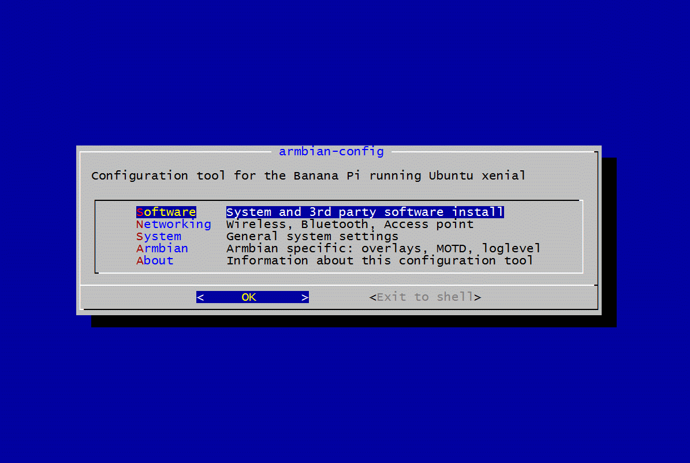

# Armbian configuration utility

Utility for configuring your board, adjusting services and installing applications. It comes with Armbian by default.

Login as root and type:

	armbian-config

- **system**
	- install to SATA, eMMC, NAND or USB
	- freeze and unfreeze kernel and BSP upgrades
	- switching between avaliable kernels and nightly builds
	- edit boot environment
	- reconfigure board settings with DT overlays or FEX (Allwinner legacy)
	- select dedicated DTB (Solidrun imx6 and Odroid XU4/HC1/HC2 boards)
	- adjust SSH daemon features
	- 3G/4G LTE modem management
	- run apt update and upgrade
	- toogle BASH/ZSH with [Oh My ZSH](https://ohmyz.sh/) and [tmux](https://en.wikipedia.org/wiki/Tmux)
	- toggle desktop and login manager (desktop builds)
	- adjusting the display resolution (some boards)
	- enabling read only root filesystem (Ubuntu)
- **network**
	- select dynamic or static IP address
	- hotspot management. Automatic detection of: nl80211, realtek, 802.11n, 802.11a and 802.11ac
	- iperf3. Toogle bandwidth measuring server
	- connect to wireless
	- install IR support
	- install support, pair and connect Bluetooth devices
	- edit IFUPDOWN interfaces
- **personal**
	- change timezone, languages and hostname
	- select welcome screen items
- **software**
	- softy
		- [TV headend](https://tvheadend.org/) *(IPTV server)*
		- [Syncthing](https://syncthing.net/) *(personal cloud)*
		- [SoftEther VPN server](https://www.softether.org/) *(VPN server)*
		- [ExaGear desktop](https://eltechs.com/product/exagear-desktop) *(x86 emulator)*
		- [Plex](https://www.plex.tv/) *(Plex media server)*
		- [Radarr](https://radarr.video/) *(Movie downloading server)*
		- [Sonarr](https://sonarr.tv/) *(TV shows downloading server)*
		- [Transmission](https://transmissionbt.com/) *(torrent server)*
		- [ISPConfig](https://www.ispconfig.org/) *(WEB & MAIL server)*
		- [NCP](https://ownyourbits.com/nextcloudplus/) *(Nextcloud personal cloud)*
		- [Openmediavault NAS](http://www.openmediavault.org/) *(NAS server)*
		- [PI hole](https://pi-hole.net) *(ad blocker)*
		- [UrBackup](https://www.urbackup.org/) *(client/server backup system)*
		- [Docker](https://www.docker.com) *(Docker CE engine)*
		- [Mayan EDMS](https://www.mayan-edms.com/) *(Document management system within Docker)*
		- [MiniDLNA](http://minidlna.sourceforge.net/) *(media sharing)*
	- monitoring tools
	- create diagnostics report
	- toggle kernel headers, RDP service, Thunderbird and Libreoffice (desktop builds)
- **help**
	- Links to documentation, support and sources

**Running this utility on 3rd party Debian based distributions**

	# Install dependencies
	apt install git iperf3 psmisc curl bc expect dialog network-manager sunxi-tools iptables \
	debconf-utils unzip dirmngr software-properties-common

	git clone https://github.com/armbian/config
	cd config
	bash debian-config

# Software testings

|Application name|Stretch|Bionic|Test install|
|:--|:--:|:--:|--:|
|TV headend (IPTV server)|:heavy_check_mark:|:heavy_check_mark:|30.09.2018|
|Syncthing (personal cloud)|:heavy_check_mark:|:heavy_check_mark:|29.09.2018|
|SoftEther VPN server (VPN server)|:heavy_check_mark:|:heavy_check_mark:|29.09.2018|
|ExaGear desktop (x86 emulator)|n/a|:question:|:question:|
|Plex (Plex media server)|:heavy_check_mark:|:heavy_check_mark:|29.09.2018|
|Radarr (Movie downloading server)|:heavy_check_mark:|:heavy_check_mark:|29.09.2018|
|Sonarr (TV shows downloading server)|:heavy_check_mark:|:heavy_check_mark:|29.09.2018|
|Transmission (torrent server)|:heavy_check_mark:|:heavy_check_mark:|29.09.2018|
|ISPConfig (WEB, SMTP, POP, IMAP, FTPD, MYSQL server)|:heavy_check_mark:|:heavy_check_mark:|29.09.2018|
|NCP (Nextcloud personal cloud)|:heavy_check_mark:|n/a|29.09.2018|
|Openmediavault NAS (NAS server)|:heavy_check_mark:|n/a|29.09.2018|
|PI hole (ad blocker)|:heavy_check_mark:|:heavy_check_mark:|29.09.2018|
|UrBackup (client/server backup system)|:heavy_check_mark:|:heavy_check_mark:|29.09.2018|
|Docker (Docker CE engine)|:heavy_check_mark:|:heavy_check_mark:|29.09.2018|
|Mayan EDMS (Document management system within Docker)|:heavy_check_mark:|:heavy_check_mark:|29.09.2018|
|MiniDLNA (Media sharing)|:heavy_check_mark:|:heavy_check_mark:|29.09.2018|
