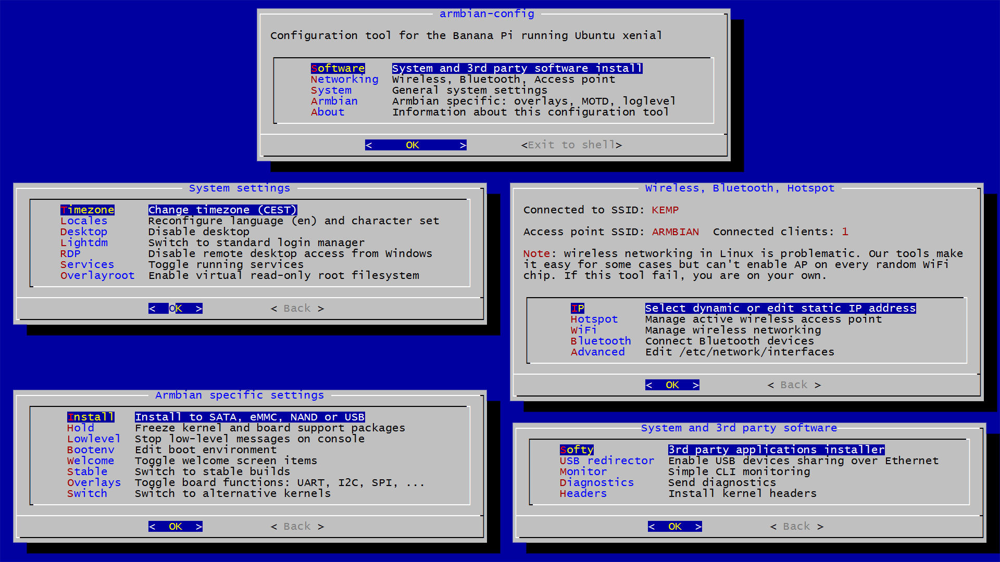

# Armbian configuration utility

Utility for configuring your board, adjust services and install applications. It comes with Armbian by default. Login and type:

	armbian-config

**Configuration**

- software
	- softy
		- [TV headend](https://tvheadend.org/) *(IPTV server)*
		- [Syncthing](https://syncthing.net/) *(personal cloud)*
		- [SoftEther VPN server](https://www.softether.org/) *(VPN server)*
		- [Transmission](https://transmissionbt.com/) *(torrent server)*
		- [ISPConfig](https://www.ispconfig.org/) *(WEB & MAIL server)*
		- [Openmediavault NAS](http://www.openmediavault.org/) *(NAS server)*
		- [PI hole](https://pi-hole.net) *(ad blocker)*
		- [MiniDLNA](http://minidlna.sourceforge.net/) *(media sharing)*
	- monitoring tools
	- create diagnostics report
	- install kernel headers
- networking
	- select dynamic or static IP address
	- manage hotspot. Automatic detection of: nl80211, realtek, 802.11n, 802.11a and 802.11ac 
	- connect to wireless
	- Bluetooth devices pair and connect,
	- edit IFUPDOWN interfaces
- system
	- change timezone
	- reconfigure locales, languages and charset
	- change hostname
	- toggle desktop (on desktop builds)
	- toggle RDP (on desktop builds)
	- toggle running servives (stock Debian app)
	- enabling read only root filesystem (Ubuntu only)  
- armbian
	- install to SATA, eMMC, NAND or USB
	- freeze and unfreeze kernel and BSP upgrades
	- edit boot environment, network, FEX, welcome screen items
	- switching between avaliable kernels and nightly builds
- about
	- basic info about tool

----------

**Installation for regular Ubuntu or Debian based distributions**

	sudo apt-get -y install git
	cd ~
	git clone https://github.com/igorpecovnik/Debian-micro-home-server
	cd Debian-micro-home-server
	sudo ./debian-config
